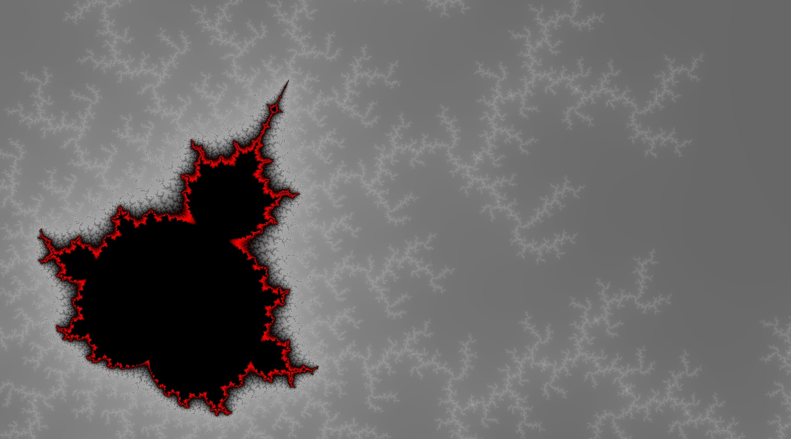

# Madelbrot set visualizer

This repo contains a Mandelbrot set visualizer implemented in C# using Cudafy and Monogame.

#### Commands
- Moving: **arrow keys** or **mouse left-click**
- Zooming: **w,a** or **mouse weel**
- Other:
  - Toggle info view: **i**
  - Increse max-iter limit: **m**
  - Decrease max-iter limit: **n**
  - Toggle full screen: **F11**
  - Take a screenshot of the current view: **F12** (saved on screenshot/*.png)
  - Reload settings: **r**
  - Update output view: **enter** (only needed if RenderMode is Manual)

#### Settings
```
{
  "InitialCenterX" :       0.261750402076009, //Initial center x view
  "InitialCenterY" :       0.0020502675513626, //Initial center y view
  "InitialViewportSizeY" : 1.15, //Initial viewport size
  "InitialMaxIter" :       200, //Initial max-iteration
  
  
  
  "ResolutionX":       1920, //Width of the form
  "ResolutionY":       1080, //Height of the form
  "RenderResolutionX": 1920, //Rendering width resolution
  "RenderResolutionY": 1080, //Rendering height resolution
  "ScreenShotResolutionX": 3840, //Screenshot width resolution
  "ScreenShotResolutionY": 2160, //Screenshot height resolution
  "FullScreen":        false, //If the form is initially fullscreen
  
  
  
  "MaxiterMode": "Static", //"Static" or "Dynamic" == "You select it" or "Increase when zooming in"
  "RenderMode":  "Fluid", //"Manual" or "Forced" or "Fluid" (Just keep Fluid)
  "MaxIterDynamicFunction": "sqrt(2 * sqrt(|1 - sqrt(5 / viewport)|)) * (maxiter / 10);", //Used only if in MaxiterMode: Dynamic, maxiter function based on actual-maxiter (can be increased with m or n) and viewport
  
  
  
  //Multiple device can be defined in order to speedup the computation
  "Devices_OpenCL_ID":  [ 0 ], //OpenCL device ID
  "Devices_SplitX":     [ 8 ], //Work split on the device, increase if crash occurs (expecially with high width resolution)
  "Maxiter_Per_Step":   [ 64 ], //Max iteration on every cuda call
  "Devices_PortionY":   [ 1 ],  //Portion of the screen that this device must compute
  
  
  
  //Colors gradients
  "Colors": [
    { "A": 255, "R":  69, "G":  69, "B":  69 },
    { "A": 255, "R": 169, "G": 169, "B": 169 },
    { "A": 255, "R":   0, "G":   0, "B":   0 },
    { "A": 255, "R": 255, "G":   0, "B":   0 },
    { "A": 255, "R": 139, "G":   0, "B":   0 },
    { "A": 255, "R":   0, "G":   0, "B":   0 }
  ],
  "Weight":           [ 1.0, 1.0, 1.0, 1.0, 1.0 ], //Color gradients weights
  "GradientFunction": "ln(x * 9 + 1) / ln(10)" //Color gradient function based on maxiter reach of every pixel (x^0.5 also good)
}
```

#### Screenshots

[More in high resolutions (Google Drive)](https://drive.google.com/drive/folders/1BXczlQU5Tz98VtBfL1rYTEiUtj2X5KoT?usp=sharing)

